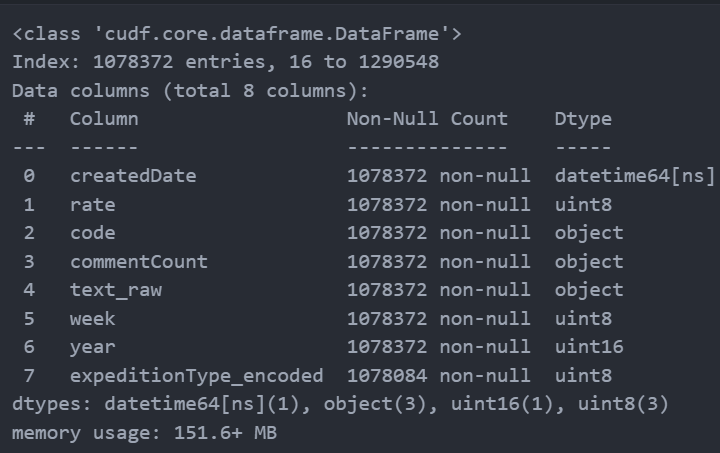
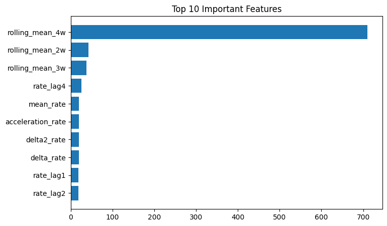
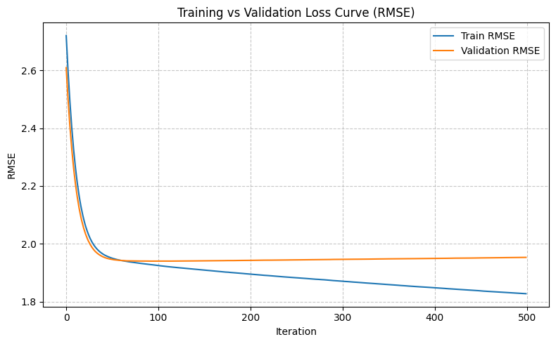
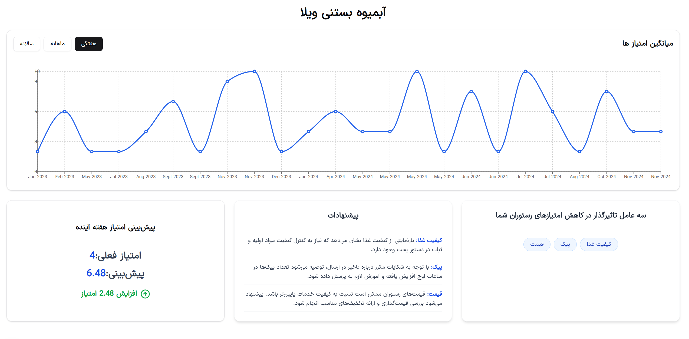
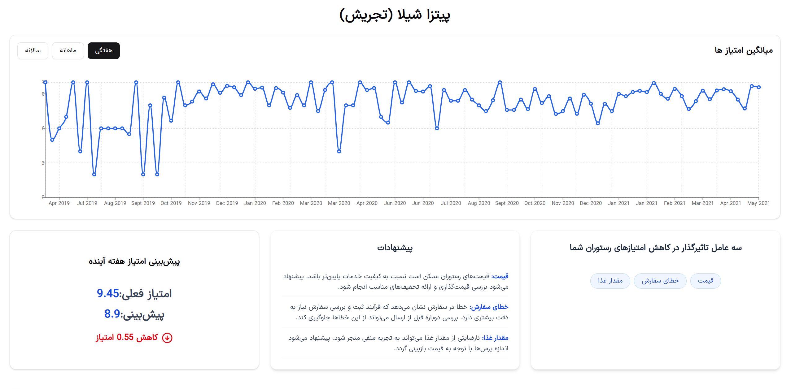

# مشاور عملکرد رستوران ها
## معرفی پروژه
<p align="justify">
این پروژه با هدف بهبود عملکرد رستوران‌ ها بر اساس کامنت‌ های کاربرانی که از آن‌ها سفارشی داشته‌اند، انجام شده است. تمرکز اصلی پروژه، پیدا کردن عوامل مؤثر در کاهش امتیاز ها و همچنین پیش‌ بینی میانگین امتیاز آن رستوران در هفته آینده است. این پروژه در دو مرحله انجام شده که هر مرحله شامل بخش‌ های مختلفی است که در ادامه به‌ ‌صورت کامل توضیح داده می‌ شود.
</p>

## پیش‌ نیازها
<p align="justify">
برای اجرای این پروژه نیاز به نصب پکیج‌ های زیر دارید که در فایل `requirements.txt` نیز آمده است:
</p>

```
fastapi
uvicorn
pandas
numpy
scikit-learn
xgboost
joblib
cudf
hazm
tabulate
gensim
matplotlib
```

<p align="justify">
نصب با دستور زیر انجام می‌ شود:
</p>

```bash
pip install -r requirements.txt
```

## مراحل انجام پروژه

### 1. خواندن داده‌ها
<p align="justify">
داده‌هایی که بر روی آن‌ها کار شده است از سایت <a href="https://www.kaggle.com/datasets/moeinkpr/snappfood-comments">snappfood-comments</a> گرفته شده است. لازم به ذکر است که این دیتاست شامل رستوران‌ها، کافه‌ها، سوپرمارکت‌ ها و قنادی‌ ها است. در پروژه فقط رستوران‌ ها در نظر گرفته شده‌اند زیرا ۸۳ درصد از کل دیتاست را کامنت‌ های مربوط به رستوران‌ ها تشکیل می‌دهند و از نظر حجم داده ارزش تحلیلی بیشتری دارند.
</p>

### 2. پیش‌پردازش داده‌ها
<p align="justify">
در دیتاست اولیه، ستون‌ هایی وجود داشتند که مقادیر تکراری یا مشابه داشتند. برای کاهش ابعاد داده، تنها یکی از ستون‌ های تکراری انتخاب شد؛ مانند [title, highlight] در فایل `vendor.csv` و [rating, rate] در فایل `comments.csv`. همچنین ستون‌ هایی که ارزش تحلیلی نداشتند (مثل [commentId, sender, customerId, feeling, status, replies]) حذف شدند.  
به‌ منظور کاهش مصرف حافظه، از تابع `auto_data_type` برای تبدیل خودکار نوع داده‌ها به کم‌حجم‌ ترین حالت ممکن بدون از دست دادن اطلاعات استفاده شد. داده‌های تکراری و مقادیر خالی نیز بررسی و حذف یا جایگزین شدند. برای مثال، در ستون نظرات مربوط به پیک (deliveryComment) اکثر رکوردها خالی بودند، بنابراین برای جلوگیری از خطا، با رشته‌ی خالی جایگزین شدند و سپس با ستون `commentText` ادغام شدند.  
در ادامه، تاریخ ایجاد کامنت‌ها به سال و هفته تفکیک شد تا تحلیل‌های زمانی ساده‌تر انجام شود. همچنین ستون `expeditionType` با روش encoding فشرده شد. نتیجه‌ی این فرایند کاهش حدود ۶۹ درصدی حجم داده‌ها بود.
</p>

<P align="center">
  
</P>

### 3. فاز اول (تشخیص عوامل تأثیرگذار در کاهش امتیاز)

#### 3-1 پردازش متن
<p align="justify">
ابتدا مجموعه‌ای از کلمات توقف (stopwords) فارسی جمع‌آوری و در پردازش نظرات استفاده شد. سپس با بهره‌گیری از کتابخانه‌ی hazm عملیات نرمال‌ سازی، حذف علائم غیر فارسی، اعداد و فاصله‌ های اضافی، توکن‌سازی، حذف کلمات توقف و ریشه‌ یابی انجام شد تا متن‌ ها برای تحلیل آماده شوند.  
از آنجا که hazm فقط روی CPU اجرا می‌شود، داده‌ ها قبل از پردازش از قالب cudf به pandas تبدیل و پس از اتمام به cudf بازگردانده شدند. پس از آن، مجموعه‌ای از دسته‌های معنایی مانند کیفیت، قیمت، ارسال و بسته‌ بندی تعیین شد. مدل Word2Vec برای یادگیری بردارهای معنایی کلمات آموزش دید و سپس الگوریتم KMeans برای خوشه‌بندی بر اساس شباهت معنایی استفاده شد تا هر کلمه در نزدیک‌ ترین گروه خود قرار گیرد.
</p>

#### 3-2 برچسب‌گذاری
<p align="justify">
در این مرحله هدف، شناسایی عوامل مؤثر بر رضایت یا نارضایتی مشتریان هر رستوران است. برای این منظور، ابتدا نظرات به دو دسته‌ی مثبت و منفی تقسیم شدند؛ نظرات با امتیاز ۴ یا بالاتر مثبت و بقیه منفی در نظر گرفته شدند(این آستانه را می توان تغییر داد). سپس داده‌ها بر اساس کد هر رستوران گروه‌بندی شدند تا برای هر رستوران مدلی مستقل ساخته شود. تنها رستوران‌هایی با بیش از ۳۰ نظر وارد مدل‌سازی شدند تا از بروز overfitting  جلوگیری شود.  
مدل XGBoostClassifier با استفاده از ویژگی‌هایی مانند کیفیت، ارسال، قیمت، بسته‌بندی، مقدار و خطای سفارش آموزش داده شد تا عوامل کلیدی مؤثر بر امتیاز شناسایی شوند. در نهایت سه عامل اصلی مؤثر برای هر رستوران استخراج شد.
</p>

### 4. فاز دوم (پیش‌بینی امتیاز)

#### 4-1 ساخت ویژگی‌ها
<p align="justify">
برای پیش‌ بینی دقیق‌ تر، متغیر هایی مانند `rate_lag1` تا `rate_lag4` (میانگین امتیاز هفته‌های قبل)، `delta_rate` (تغییر امتیاز هفته جاری نسبت به قبل) و `acceleration_rate` (سرعت تغییر امتیازها) ساخته شدند. همچنین میانگین متحرک دو، سه و چهار هفته اخیر محاسبه شد. متغیر هدف (`y_next`) نیز میانگین امتیاز هفته آینده است که مدل باید پیش‌ بینی کند.
</p>

#### 4-2 آموزش مدل
<p align="justify">
داده‌ها به pandas تبدیل و ویژگی‌های غیرضروری (مثل کد رستوران، سال و هفته) حذف شدند. از کل داده‌ها برای آموزش استفاده شد چون ماهیت زمانی داده‌ها اجازه‌ی تقسیم تصادفی را نمی دهد. این کار باعث شد مدل بتواند الگوهای واقعی تغییرات را بیاموزد. نتایج نهایی مدل در معیارهای MAE و R² نشان‌دهنده‌ی عملکرد مناسب مدل بودند.
</p>

#### 4-3 پیش‌ بینی امتیاز هفته آینده
<p align="justify">
داده‌ها به صورت هفتگی آماده و آخرین رکورد هر رستوران انتخاب شد. مدل با استفاده از ویژگی‌ های ساخته‌شده امتیاز هفته‌ی آینده را پیش‌ بینی می‌ کند. در نهایت اختلاف بین امتیاز فعلی و پیش‌ بینی‌ شده (`expected_change`) محاسبه و بر اساس آن، رستوران‌ها بر حسب احتمال بهبود یا افت امتیاز مرتب شدند.
</p>

## 📊 ارزیابی پروژه

### نتایج فاز اول
<p align="justify">
نمودار زیر نشان می‌دهد کدام ویژگی‌ها بیشترین کمک را به مدل برای یادگیری ارتباط بین امتیاز و عوامل مختلف کرده‌اند. همان‌طور که مشخص است، میانگین‌ های هفتگی بیشترین تأثیر را داشته‌اند.
</p>



<p align="justify">
از جدول زیر می‌توان مشاهده کرد که میانگین خطاها برای کل رستوران‌ها محاسبه شده است. برخی رستوران‌ها ممکن است خطای بیشتری داشته باشند به دلیل کم بودن تعداد کامنت‌ هایشان. بااین‌ حال با اعمال محدودیت‌ هایی تلاش شد این خطا به حداقل برسد.
</p>

|   MAE   |   MSE   |  RMSE  |   R²   | Train Time (s) | Predict Time (s) |
|:-------:|:-------:|:------:|:------:|:---------------:|:----------------:|
| 1.4546  | 3.8147  | 1.9531 | 0.4629 |       1.85      |       0.02       |



### نتایج فاز دوم
<p align="justify">
همان‌ طور که از جدول زیر مشخص است، مدل توانسته است به‌ خوبی ارتباط بین عوامل مؤثر در کاهش امتیاز و رضایت مشتریان را شناسایی کند.
</p>

| Accuracy | Precision | Recall | F1 | Train Time (s) | Predict Time (s) |
|:----------|:-----------:|:--------:|:----:|:----------------:|:------------------:|
| 0.8303 | 0.8323 | 0.9903 | 0.9007 | 0.7222 | 0.0123 |

## دمو پروژه
<p align="justify">
برای خروجی ‌گرفتن از مدل و ذخیره ‌سازی آن، از کتابخانه joblib استفاده شده تا مدل آموزش ‌دیده به ‌صورت فایل ذخیره و در API بارگذاری شود.  
یک سرویس FastAPI طراحی شده تا خروجی ‌های مدل از طریق یک endpoint در دسترس باشند. این سرویس روی سایت Render توسعه داده شده و با ارسال درخواست (با پارامتر code) می‌ توان امتیاز پیش‌ بینی ‌شده‌ هفته آینده  آن رستوران را دریافت کرد.  


همچنین وب‌ سایتی داشبوردی برای نمایش روند امتیازها و پیش‌ بینی‌ ها توسعه داده شده که از طریق آدرس زیر در دسترس است:
</p>

آدرس وب‌ سایت: [https://restaurant-advisor-dashboard.vercel.app](https://restaurant-advisor-dashboard.vercel.app)

<p align="center">
  
  
</p>

## 📁 ساختار پوشه‌ها
```
restaurant-performance-advisor/
│
├── api/
├── model.pkl 
├── predict.py 
├── weekly_data.csv 
│
└── images/ 
    ├── chart_phase1.png 
    ├── demo1.png 
    ├── demo2.png  
    ├── feature_importance_phase1.png 
```